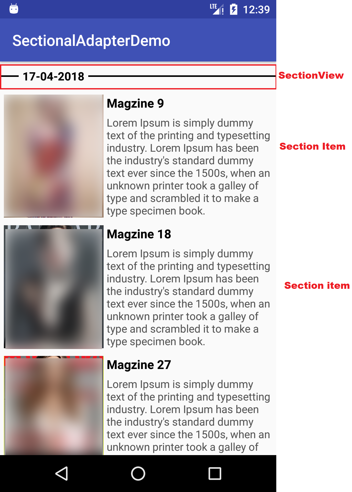
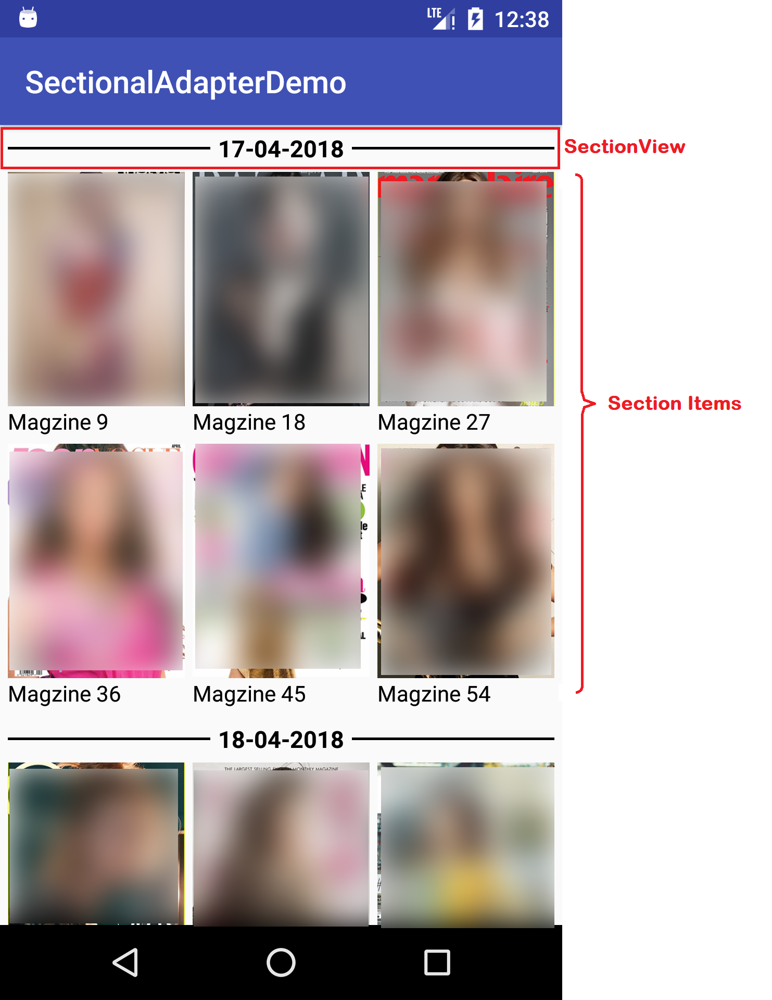

# Sectional Adapter #

An android library demo that let you make you RecyclerView and GridView Adapter sectional

## Introduction: ##

This Demo Application will help you to implement sectional adapter in you android applications.

## Usage: ##

To use Sectional Adapter in you project you need to some changes in your projects:
### Prerequisites: ###
Include library to build.gradle app level:

	implementation 'io.github.muhammadmuzammilsharif:sectionaladapter:1.0'
		  
if your application not using jcenter repository then add  
**_(only if in repositories session "jcenter()" is not included_**
		
	allprojects {
   			repositories {
      			maven { url "https://dl.bintray.com/muhammadmuzammilsharif/library" }
   			...
			}
	} 
### Layout XML ###

for both Sectional Recycler View and GridView we need to have the same xml layout but different adapter.
 
    <android.support.v7.widget.RecyclerView
        android:id="@+id/recycler"
        android:layout_width="match_parent"
        android:layout_height="match_parent">

    </android.support.v7.widget.RecyclerView>

### SectionalRecyclerViewAdapter: ###

to implement Sectional adapter in RecyclerView you need to make that recyclerView Adapter and extend it with **SectionalRecyclerViewAdapter** like:
    
    Java:
    public class RecyclerViewAdapter extends SectionalRecyclerViewAdapter<K, T> {
        ... 
    }
     
    Kotlin:
    class RecyclerViewAdapterKt : SectionalRecyclerViewAdapter<K, T> {
        ...
    }

after extending the **SectionalRecyclerViewAdapter** it will force you to override methods given bellow:

1. **onCreateHeaderViewHolder** method with return type _RecyclerView.ViewHolder_ for Section Header
2. **onBindHeaderViewHolder** method to set values to SectionHeader ViewHolder
3. **onCreateSectionItemViewHolder** method with return type _RecyclerView.ViewHolder_ for Section items
4. **onBindSectionItemViewHolder** method to set values to Section item viewHolder

these methods are same as in normal RecyclerView Adapter for more detail see **_[DummySectionRecyclerAdapter][javaDummyRecyclerAdapter]_** for java and **_[DummySectionRecyclerAdapterKt][kotlinDummyRecyclerAdapter]_** for Kotlin.



### SectionalGridViewAdapter ###

to implement Sectional adapter in RecyclerView for SectionalGridView you need to make that recyclerView Adapter and extend it with **SectionalGridAdapter** like:

    Java:
    public class RecyclerViewAdapter extends SectionalGridAdapter<K, T> {
        ... 
    }
     
    Kotlin:
    class RecyclerViewAdapterKt : SectionalGridAdapter<K, T> {
        ...
    }

#### Note: ####
- **"K"** is Section Model it can also be predefine data types like (int, String, etc.)
- **"T"** is Section Items Model and it must be implements **SectionalUniqueObject** interface like:

```
Java: 
public class DummyData implements SectionalUniqueObject<K> {...}  
```

```
Kotlin:
class DummyData : SectionalUniqueObject<K> {...}
```
   **note:** after implement **SectionalUniqueObject** interface it force you to override two methods
   
    - **getSection()** of return type **"K"**: this method return SectionModel to which this object belong  
    - **getUniqueKey()** of return type **"Object"** (**"Any"** in Kotlin): this method return unique key or id of sectionItem to avoid repetition of item in same section

after extending the **SectionalGridAdapter** it will force you to override methods given bellow:

1. **getColumnCount:** must return number of column show in each row at least `2`
2. **getHorizontalSpacing:** must return spacing between two column in pixels
3. **getVerticalSpacing:** must return spacing between two rows in pixels
4. **getSingleViewHeight** must return each column height if you want a fixed height in pixels though out your grid view or return `WRAP_CONTENT` if you don't what to set it fixed.
5. **getHeaderViewHolder** must return `RecyclerView.ViewHolder` for Section Header
6. **setDataToHeader** method to set values to SectionHeader ViewHolder
7. **getView** must return `View` for each column with data given in method parameters

for more detail see **_[DummySectionGridAdapter][javaDummyGridAdapter]_** for java and **_[DummySectionGridAdapterKt][kotlinDummyGridAdapter]_** for Kotlin.



#### Note: ####
if you wanted to sort data showing through Sectional RecyclerAdapter or GridAdapter you are allow to override methods given bellow:

- **compareSections** with two parameters of type **K** i.e. `SectionModel` with int return type.
- **compareSectionItems** with two parameters of type **T** i.e. `SectionItemModel` with int return type.

these method are just like simple _Comparator_ method `onCompare`


[javaDummyGridAdapter]: https://github.com/MuhammadMuzammilSharif/sectionalAdapter/blob/master/app/src/main/java/io/github/muhammadmuzammilsharif/sectionaladapterdemo/Adapter/GridViewAdapter.java
[kotlinDummyGridAdapter]: https://github.com/MuhammadMuzammilSharif/sectionalAdapter/blob/master/app/src/main/java/io/github/muhammadmuzammilsharif/sectionaladapterdemo/Adapter/GridViewAdapterKt.kt
[javaDummyRecyclerAdapter]: https://github.com/MuhammadMuzammilSharif/sectionalAdapter/blob/master/app/src/main/java/io/github/muhammadmuzammilsharif/sectionaladapterdemo/Adapter/RecyclerViewAdapter.java
[kotlinDummyRecyclerAdapter]: https://github.com/MuhammadMuzammilSharif/sectionalAdapter/blob/master/app/src/main/java/io/github/muhammadmuzammilsharif/sectionaladapterdemo/Adapter/RecyclerViewAdapterKt.kt